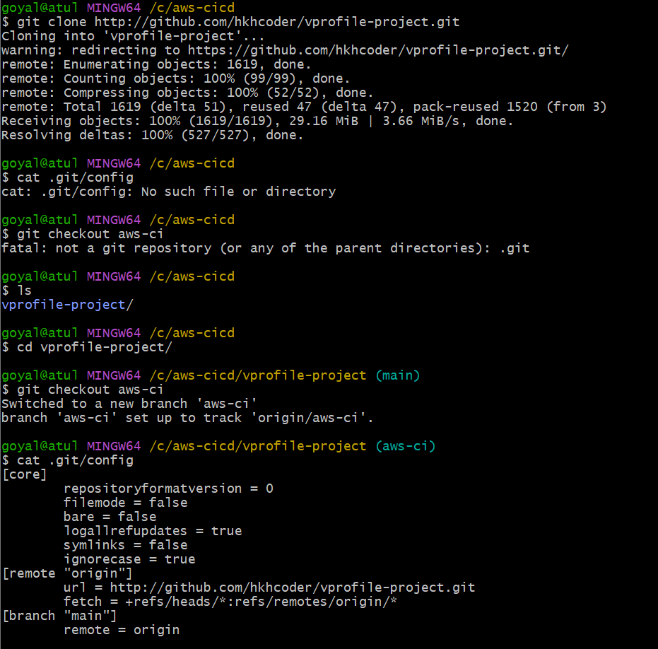

# **AWS CI/CD Project**

This project implements a fully automated CI/CD pipeline to streamline the process of building, testing, and deploying applications using AWS services. The pipeline is integrated with **Bitbucket** for source code management and deploys the application to **AWS Elastic Beanstalk** for hosting.

---

## **Project Architecture**

Below is an overview of the CI/CD architecture:


---

## **Project Images**

Here are screenshots of the implementation process:

  
  
  
  
  
  


---

## **Project Workflow**

### **1. Bitbucket as Code Source**
- The source code is managed in a **Bitbucket repository**.
- Any changes pushed to the repository trigger the **AWS CodePipeline**, initiating the CI/CD process.

### **2. AWS CodePipeline**
- Serves as the backbone of the CI/CD process.
- Fetches the source code from Bitbucket, runs the build process using **AWS CodeBuild**, and deploys the final artifact to **AWS Elastic Beanstalk**.

### **3. AWS CodeBuild**
- Compiles the code, runs tests, and prepares the build artifacts for deployment.
- Uses the `buildspec.yml` file in the repository to define the build instructions.

### **4. AWS Elastic Beanstalk**
- Manages the deployment of the application.
- Automatically provisions and scales infrastructure (e.g., **EC2 instances**, **load balancers**) to host the application.

### **5. Scaling and Monitoring**
- **AWS Elastic Beanstalk** provides automatic scaling based on traffic.
- Includes integrated monitoring for performance and availability.

---

## **Prerequisites**

To set up and use this CI/CD pipeline, ensure the following prerequisites are met:

1. **AWS Account**  
   - Permissions to manage **CodePipeline**, **CodeBuild**, **Elastic Beanstalk**, and related services.

2. **Bitbucket Repository**  
   - The application’s source code must be pushed to a Bitbucket repository.

3. **buildspec.yml**  
   - A `buildspec.yml` file in your repository to define the build steps.

4. **Elastic Beanstalk**  
   - An Elastic Beanstalk application and environment configured to deploy your application.

---

## **Setting Up the CI/CD Pipeline**

### **1. Set Up a Bitbucket Repository**
- Push your application’s source code to a Bitbucket repository.

### **2. Configure AWS CodePipeline**
- Create a new pipeline using the AWS Management Console.
- Set Bitbucket as the source stage and link it to your repository.

### **3. Create an AWS CodeBuild Project**
- Define a build project in AWS CodeBuild.
- Include a `buildspec.yml` file in your repository to specify the build steps.

### **4. Deploy to Elastic Beanstalk**
- Configure Elastic Beanstalk as the deployment stage in AWS CodePipeline.
- Ensure the build artifacts are compatible with your Elastic Beanstalk environment.

---

## **Sample buildspec.yml**

Below is an example of a `buildspec.yml` file to guide your build process:

```yaml
version: 0.2

phases:
  install:
    commands:
      - echo "Installing dependencies..."
      - npm install
  build:
    commands:
      - echo "Building the application..."
      - npm run build
  post_build:
    commands:
      - echo "Preparing for deployment..."
      - zip -r app.zip .
artifacts:
  files:
    - app.zip


## **Benefits of the CI/CD Pipeline** ##
Automation: Eliminates manual intervention in the deployment process, improving efficiency.
Scalability: Automatically scales applications using Elastic Beanstalk to handle varying traffic loads.
Reliability: Ensures consistent and error-free deployments with testing integrated into the build phase.
Integration: Provides seamless integration between Bitbucket and AWS services.


## **Future Enhancements** ##
Introduce automated security scans during the build phase.
Implement a blue/green deployment strategy to reduce downtime during updates.
Add notification and alerting mechanisms for build or deployment failures.
Enhance logging and monitoring capabilities using AWS CloudWatch.


